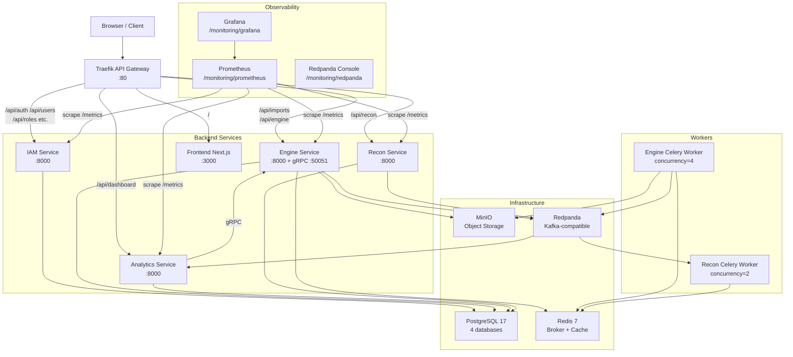
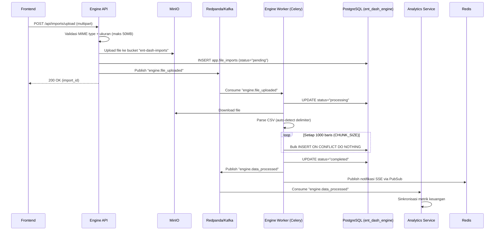
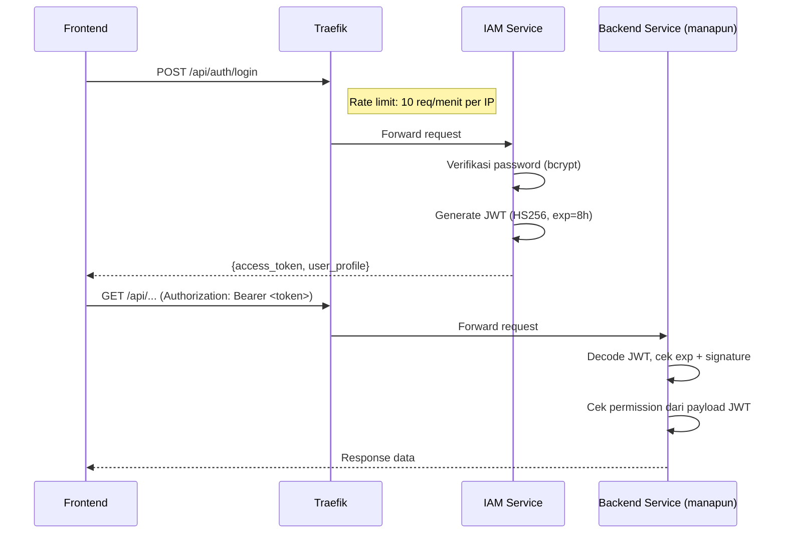
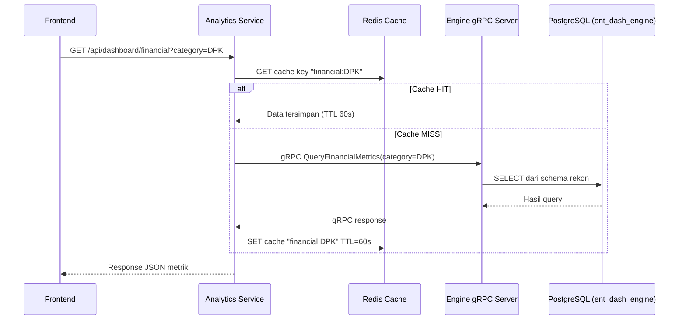
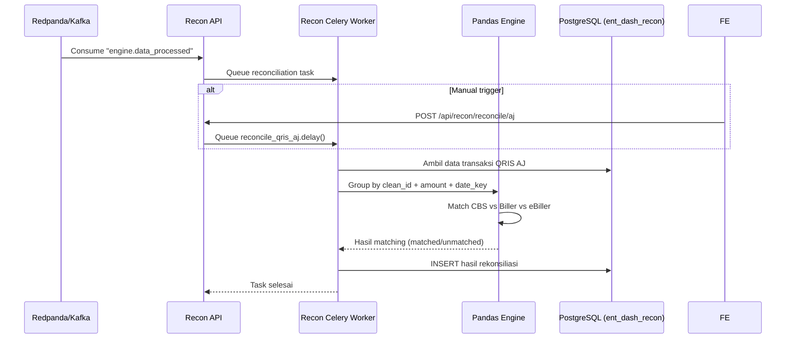

# Arsitektur Enterprise Dashboard

> Dokumen ini adalah referensi teknis arsitektur untuk platform **Enterprise Dashboard** — sistem manajemen data keuangan dan operasional berbasis microservices. Dokumen ini melengkapi `Technical_Specification.md` yang sudah ada di root repository.

---

## Daftar Isi

1. [Gambaran Umum Proyek](#1-gambaran-umum-proyek)
2. [Topologi Sistem](#2-topologi-sistem)
3. [Arsitektur Per Service](#3-arsitektur-per-service)
   - [IAM Service](#31-iam-service-ent-dash-iam)
   - [Engine Service](#32-engine-service-ent-dash-engine)
   - [Analytics Service](#33-analytics-service-ent-dash-analytics)
   - [Recon Service](#34-recon-service-ent-dash-recon)
   - [Frontend](#35-frontend-ent-dash-fe)
4. [Infrastruktur & DevOps](#4-infrastruktur--devops)
5. [Alur Data](#5-alur-data)
6. [Arsitektur Database](#6-arsitektur-database)
7. [Arsitektur Keamanan](#7-arsitektur-keamanan)
8. [Konvensi Koding](#8-konvensi-koding)
9. [Strategi Testing](#9-strategi-testing)
10. [Konfigurasi Lingkungan](#10-konfigurasi-lingkungan)

---

## 1. Gambaran Umum Proyek

Enterprise Dashboard adalah platform microservices untuk manajemen data keuangan enterprise, rekonsiliasi transaksi QRIS, dan monitoring operasional. Sistem ini dibangun di atas prinsip:

- **Event-Driven Architecture** — komunikasi antar service melalui Kafka (async) dan gRPC (sync)
- **Database per Service** — setiap service memiliki database PostgreSQL-nya sendiri
- **Stateless Auth** — JWT tanpa session table; identitas ada di dalam token
- **OOP Strict** — backend menggunakan pola Controller → Service → Repository

### Komponen Utama

| Komponen | Teknologi | Tanggung Jawab |
|---|---|---|
| `ent-dash-iam` | FastAPI + PostgreSQL | Autentikasi, RBAC, Audit, Kepatuhan UU PDP |
| `ent-dash-engine` | FastAPI + Celery + MinIO + Kafka | Import CSV, pemrosesan data, gRPC server |
| `ent-dash-analytics` | FastAPI + gRPC client + Redis | Metrik keuangan, analisis QRIS, caching |
| `ent-dash-recon` | FastAPI + Celery + Pandas | Engine rekonsiliasi QRIS AJ, Rintis, ONUS |
| `ent-dash-fe` | Next.js 16 + shadcn/ui | Antarmuka pengguna berbasis React 19 |
| Traefik | Traefik v3 | API Gateway, routing path-based, rate limiting |
| PostgreSQL | PostgreSQL 17 | 4 database terisolasi per service |
| Redis | Redis 7 | Celery broker + cache analytics |
| MinIO | MinIO (S3-compatible) | Penyimpanan file CSV yang diupload |
| Redpanda | Redpanda (Kafka-compatible) | Event bus antar service |

---

## 2. Topologi Sistem

Semua request masuk melalui **Traefik** di port `80` yang merouting ke service yang tepat berdasarkan path prefix. Frontend di-serve dengan prioritas terendah (catch-all).



### Tabel Routing Traefik

| Path Prefix | Tujuan | Prioritas |
|---|---|---|
| `/api/auth/login` | IAM (+ rate limit 10 req/menit) | 100 |
| `/api/auth`, `/api/users`, `/api/roles`, `/api/permissions`, `/api/positions`, `/api/organization-units`, `/api/admin`, `/api/system-config`, `/api/user` | IAM | 50 |
| `/api/imports`, `/api/engine` | Engine | 45 |
| `/api/dashboard` | Analytics | 45 |
| `/api/recon` | Recon | 40 |
| `/monitoring/grafana` | Grafana | 65 |
| `/monitoring/prometheus` | Prometheus | 65 |
| `/monitoring/redpanda` | Redpanda Console | 65 |
| `/` | Frontend | 1 (catch-all) |

---

## 3. Arsitektur Per Service

### 3.1 IAM Service (`ent-dash-iam`)

**Tanggung jawab:** Autentikasi pengguna, manajemen RBAC, hierarki organisasi, audit forensik, dan kepatuhan UU PDP.

**Tech Stack:** FastAPI 0.115.6 · SQLAlchemy 2.0 asyncpg · python-jose (JWT HS256) · bcrypt · Alembic

**File kunci:**

| File | Fungsi |
|---|---|
| `ent-dash-iam/app/main.py` | FastAPI app, lifespan, middleware |
| `ent-dash-iam/app/api/main.py` | Agregasi semua router |
| `ent-dash-iam/app/api/deps.py` | `get_current_user_payload` — validasi JWT |
| `ent-dash-iam/app/services/auth.py` | `AuthService` — login, pembuatan token |
| `ent-dash-iam/app/services/users.py` | `UserService` — CRUD user |
| `ent-dash-iam/app/services/audit.py` | `AuditService` — pencatatan forensik |
| `ent-dash-iam/app/services/compliance.py` | `ComplianceService` — enforment UU PDP |
| `ent-dash-iam/app/models/user.py` | Model: User, Position, OrganizationUnit |
| `ent-dash-iam/app/models/role_permission.py` | Model: Role, Permission, ModelHasRole, RoleHasPermission |
| `ent-dash-iam/app/models/audit_log.py` | Model: AuditLog |

**API Routes (prefix: `/api`):**

| Method | Path | Fungsi |
|---|---|---|
| POST | `/api/auth/login` | Login, kembalikan JWT |
| POST | `/api/auth/refresh` | Perbarui token |
| GET/POST | `/api/users` | Daftar / buat user |
| PUT | `/api/users/{id}/roles` | Assign role ke user |
| GET/POST | `/api/roles` | CRUD role |
| GET/POST | `/api/permissions` | CRUD permission |
| GET | `/api/positions` | Daftar posisi organisasi |
| GET | `/api/organization-units/tree` | Pohon hierarki organisasi |
| GET | `/api/audit-logs` | Riwayat forensik audit |
| GET | `/api/compliance/report` | Laporan kepatuhan UU PDP |
| GET | `/api/system-config` | Konfigurasi sistem dinamis |

**Pola RBAC (Spatie-like):**

```
User ──(ModelHasRole)──> Role ──(RoleHasPermission)──> Permission
                          │
                    "Super Admin"
                    "Finance Manager"
                    "Operator"
```

---

### 3.2 Engine Service (`ent-dash-engine`)

**Tanggung jawab:** Upload dan pemrosesan file CSV/Excel, penyimpanan objek di MinIO, penerbitan event Kafka, server gRPC untuk Analytics, dan Data Explorer CRUD.

**Tech Stack:** FastAPI 0.115.6 · Celery 5.3.6 · SQLAlchemy 2.0 asyncpg + psycopg2 · MinIO 7.2 · confluent-kafka 2.3 · gRPC

**File kunci:**

| File | Fungsi |
|---|---|
| `ent-dash-engine/app/main.py` | FastAPI app, lifespan, init gRPC server |
| `ent-dash-engine/app/api/main.py` | Agregasi router: imports, engine, notifications, data_explorer |
| `ent-dash-engine/app/api/deps.py` | JWT validation + `require_engine_permission` |
| `ent-dash-engine/app/services/imports.py` | `ImportService` — orchestrate upload, MinIO, Kafka |
| `ent-dash-engine/app/services/data_explorer.py` | `DataExplorerService` — generic CRUD 9 tabel |
| `ent-dash-engine/app/tasks/imports.py` | Celery task `process_csv_import` — parse + bulk insert |
| `ent-dash-engine/app/grpc_server.py` | gRPC server — layani query Analytics |
| `ent-dash-engine/app/core/storage.py` | Logika upload ke MinIO |

**API Routes:**

| Method | Path | Fungsi |
|---|---|---|
| POST | `/api/imports/upload` | Upload CSV ke MinIO, publish Kafka |
| GET | `/api/imports` | Daftar import milik user |
| GET | `/api/imports/{id}` | Detail record import |
| POST | `/api/imports/{id}/cancel` | Batalkan import |
| POST | `/api/imports/{id}/retry` | Ulangi import gagal |
| GET | `/api/engine/notifications` | SSE stream notifikasi real-time |
| GET | `/api/engine/explorer/tables` | Daftar tabel di Data Explorer |
| GET | `/api/engine/explorer/{table_key}/schema` | Skema kolom tabel |
| GET | `/api/engine/explorer/{table_key}` | Daftar record dengan paginasi |
| POST | `/api/engine/explorer/{table_key}` | Buat record baru |
| PUT | `/api/engine/explorer/{table_key}/{id}` | Perbarui record |
| DELETE | `/api/engine/explorer/{table_key}/{id}` | Hapus record |

**Whitelist tabel Data Explorer** (hanya 9 tabel diizinkan):

```
engine_sts_load_data, engine_sts_load_data_his,
engine_sts_proses_rpt, engine_sts_proses_rpt_his,
rekon_qris_aj, rekon_qris_onus, rekon_qris_rintis,
engine_job_log, engine_job_entry_log
```

---

### 3.3 Analytics Service (`ent-dash-analytics`)

**Tanggung jawab:** Menyajikan metrik keuangan dan analisis QRIS. Mengonsumsi event Kafka dari Engine dan melakukan query ke Engine DB via gRPC. Hasil dikache di Redis (TTL 60 detik).

**Tech Stack:** FastAPI 0.115.6 · SQLAlchemy 2.0 asyncpg · gRPC (client) · Redis (cachetools) · confluent-kafka

**File kunci:**

| File | Fungsi |
|---|---|
| `ent-dash-analytics/app/main.py` | FastAPI app, inisialisasi gRPC channel |
| `ent-dash-analytics/app/api/main.py` | Router: financial, qris |
| `ent-dash-analytics/app/services/financial.py` | `FinancialService` — agregasi metrik DPK/Kredit/Rasio |
| `ent-dash-analytics/app/services/qris.py` | `QrisService` — analisis QRIS + AI via Gemini |
| `ent-dash-analytics/app/services/sync.py` | Kafka consumer → sinkronisasi data dari Engine |
| `ent-dash-analytics/app/core/grpc_client.py` | Singleton gRPC channel (lazy-init) |
| `ent-dash-analytics/app/core/cache.py` | Redis abstraction: `get_cached_response`, `set_cached_response` |

**API Routes (prefix: `/api/dashboard`):**

| Method | Path | Fungsi |
|---|---|---|
| GET | `/api/dashboard/financial` | Metrik keuangan `?category=DPK\|KREDIT\|RATIO` (Redis cache 60s) |
| GET | `/api/dashboard/qris-analysis` | Analisis QRIS berbasis AI |

---

### 3.4 Recon Service (`ent-dash-recon`)

**Tanggung jawab:** Engine rekonsiliasi transaksi QRIS untuk jaringan Artajasa (AJ), Rintis, dan ONUS. Dikonsumsi oleh Celery worker yang dipicu Kafka event dari Engine.

**Tech Stack:** FastAPI 0.115.6 · Celery 5.3.6 · SQLAlchemy 2.0 · Pandas 2.2 · confluent-kafka

**File kunci:**

| File | Fungsi |
|---|---|
| `ent-dash-recon/app/main.py` | FastAPI app |
| `ent-dash-recon/app/worker.py` | Konfigurasi Celery |
| `ent-dash-recon/app/api/routes/rekon.py` | Semua endpoint rekon |
| `ent-dash-recon/app/tasks/reconciliation.py` | Celery tasks: `reconcile_qris_aj`, `reconcile_rintis`, `reconcile_onus` |
| `ent-dash-recon/app/core/events.py` | Kafka event handler |

**API Routes (prefix: `/api/recon`):**

| Method | Path | Fungsi |
|---|---|---|
| GET | `/api/recon/status` | Status kesehatan service |
| GET | `/api/recon/dashboard/aj-stats` | Statistik rekonsiliasi AJ |
| GET | `/api/recon/dashboard/rintis-stats` | Statistik rekonsiliasi Rintis |
| GET | `/api/recon/dashboard/onus-stats` | Statistik rekonsiliasi ONUS |
| GET | `/api/recon/dashboard/qris-transactions` | Daftar transaksi QRIS |
| GET | `/api/recon/dashboard/rintis-transactions` | Daftar transaksi Rintis |
| GET | `/api/recon/dashboard/onus-transactions` | Daftar transaksi ONUS |
| POST | `/api/recon/reconcile/{network}` | Picu rekonsiliasi manual (antri Celery task) |

**Algoritma Rekonsiliasi:**
- **QRIS AJ:** Grup berdasarkan `clean_id`, `transaction_amount`, `date_key` → cocokkan record CBS/Biller/eBiller
- **Rintis / ONUS:** Algoritma matching paralel per jaringan masing-masing

---

### 3.5 Frontend (`ent-dash-fe`)

**Tanggung jawab:** Antarmuka pengguna Next.js yang di-serve Traefik. Semua panggilan API di-proxy ke `/api/*` melalui Next.js rewrites → Traefik → service tujuan.

**Tech Stack:** Next.js 16 · React 19 · Tailwind CSS v4 · shadcn/ui (Radix UI) · React Hook Form + Zod · SWR + Axios · Recharts 3 · TypeScript 5

**Halaman Utama:**

| Route | Komponen | Fungsi |
|---|---|---|
| `/login` | `app/login/page.tsx` | Form autentikasi |
| `/direksi/kinerja-keuangan` | `app/(dashboard)/direksi/kinerja-keuangan/page.tsx` | Dashboard KPI keuangan |
| `/rekon-engine` | `app/(dashboard)/rekon-engine/page.tsx` | Dashboard rekonsiliasi |
| `/rekon-engine/import` | `app/(dashboard)/rekon-engine/import/page.tsx` | Upload file CSV/Excel |
| `/divisi-operasi/*` | `app/(dashboard)/divisi-operasi/` | Dashboard operasional AJ/Rintis/ONUS |
| `/admin/iam/users` | `app/(dashboard)/admin/iam/users/page.tsx` | Manajemen pengguna |
| `/admin/iam/audit-logs` | `app/(dashboard)/admin/iam/audit-logs/page.tsx` | Riwayat audit forensik |
| `/admin/compliance` | `app/(dashboard)/admin/compliance/page.tsx` | Laporan UU PDP |
| `/admin/monitoring` | `app/(dashboard)/admin/monitoring/page.tsx` | Grafana embedded |
| `/settings/roles` | `app/(dashboard)/settings/roles/page.tsx` | Manajemen role & permission |
| `/settings/system-config` | `app/(dashboard)/settings/system-config/page.tsx` | Konfigurasi sistem dinamis |
| `/engine/data-explorer` | `app/(dashboard)/engine/data-explorer/page.tsx` | CRUD Data Explorer generik |

**Layer Service Frontend:**

| Service | File | Tanggung Jawab |
|---|---|---|
| AuthService | `services/AuthService.ts` | Login, logout, token refresh |
| IAMService | `services/IAMService.ts` | CRUD users, roles, permissions |
| FinancialService | `services/FinancialService.ts` | Data dashboard keuangan |
| ReconService | `services/ReconService.ts` | Status dan trigger rekonsiliasi |
| DataExplorerService | `services/DataExplorerService.ts` | CRUD generik Data Explorer |
| SystemConfigService | `services/SystemConfigService.ts` | Konfigurasi sistem |
| AuditService | `services/AuditService.ts` | Fetch audit logs |
| ComplianceService | `services/ComplianceService.ts` | Data compliance UU PDP |

**Konfigurasi keamanan** (lihat `ent-dash-fe/next.config.ts`):
- CSP header `default-src 'self'`
- `X-Frame-Options: SAMEORIGIN`
- `Strict-Transport-Security`
- Rewrites `/api/*` dan `/monitoring/*` ke Traefik backend

---

## 4. Infrastruktur & DevOps

Semua container didefinisikan di `docker-compose.yml`. Satu PostgreSQL instance mengelola 4 database. Inisialisasi multi-database dilakukan oleh `postgres-init/init-multiple-databases.sh`.

### Daftar Container

| Container | Image | Port (host) | Fungsi |
|---|---|---|---|
| `ent_dash_traefik` | traefik:v3.0 | 80, 8080 | API Gateway |
| `ent_dash_db` | postgres:17-alpine | 5434 | Database utama (4 DB) |
| `ent_dash_redis` | redis:7-alpine | 6379 | Celery broker + Redis cache |
| `ent_dash_minio` | minio/minio | 9000, 9001 | Object storage (CSV files) |
| `ent_dash_redpanda` | redpanda/redpanda | 19092, 18082 | Kafka-compatible event bus |
| `ent_dash_redpanda_console` | redpanda/console | 8081 | UI monitoring Kafka topics |
| `ent_dash_iam` | ent-dash-iam | — | IAM Service |
| `ent_dash_engine` | ent-dash-engine | — | Engine Service + gRPC |
| `ent_dash_engine_worker` | ent-dash-engine | — | Celery worker Engine (concurrency=4) |
| `ent_dash_analytics` | ent-dash-analytics | — | Analytics Service |
| `ent_dash_recon_api` | ent-dash-recon | — | Recon Service |
| `ent_dash_celery` | ent-dash-recon | — | Celery worker Recon (concurrency=2) |
| `ent_dash_frontend` | ent-dash-frontend | — | Frontend Next.js |
| `ent_dash_prometheus` | prom/prometheus | 9090 | Metrics scraper (interval 15s) |
| `ent_dash_grafana` | grafana/grafana | 3001 | Visualisasi metrics |

### Volume Persisten

| Volume | Konten |
|---|---|
| `enterprisedashboard_pgdata` | Data PostgreSQL (external, harus dibuat manual) |
| `ent_dash_minio_data` | File CSV yang diupload |
| `ent_dash_redpanda_data` | Kafka topic data |
| `ent_dash_recon_uploads` | Upload lokal Recon |
| `ent_dash_prometheus_data` | Data timeseries Prometheus |
| `ent_dash_grafana_data` | Dashboard dan konfigurasi Grafana |

### Observabilitas

Semua FastAPI service mengekspos `/metrics` via `prometheus-fastapi-instrumentator`. Prometheus melakukan scrape setiap 15 detik. Grafana dikonfigurasi dengan provisioning otomatis dari `observability/grafana/provisioning/`.

---

## 5. Alur Data

### 5.1 Alur Import File CSV



### 5.2 Alur Autentikasi



### 5.3 Alur Query Analytics



### 5.4 Alur Rekonsiliasi



---

## 6. Arsitektur Database

Satu instance PostgreSQL 17 berisi 4 database terpisah, masing-masing dimiliki oleh satu service. Tidak ada query lintas database — komunikasi antar service menggunakan API/gRPC/Kafka.

### Database: `ent_dash_iam`

**Schema:** `app`

| Tabel | Fungsi |
|---|---|
| `users` | Data pengguna (email, password hash, status aktif) |
| `positions` | Posisi dalam organisasi |
| `organization_units` | Unit organisasi (struktur pohon) |
| `roles` | Daftar role (Super Admin, Finance Manager, dll.) |
| `permissions` | Daftar permission granular (e.g. `engine.import`) |
| `model_has_roles` | Junction: user → role (many-to-many) |
| `role_has_permissions` | Junction: role → permission (many-to-many) |
| `audit_logs` | Log forensik semua aksi (IP, user-agent, endpoint) |
| `system_config` | Konfigurasi sistem dinamis (CORS, settings) |

### Database: `ent_dash_engine`

**Schema:** `app` (metadata import) + `rekon` (data operasional)

| Tabel | Schema | Fungsi |
|---|---|---|
| `file_imports` | `app` | Metadata upload (UUID, status, MinIO path, Kafka flag) |
| `engine_job_log` | `rekon` | Log eksekusi job ETL |
| `engine_job_entry_log` | `rekon` | Log detail per step ETL |
| `engine_process_group` | `rekon` | Grup proses batch |
| `engine_process_group_his` | `rekon` | Historis grup proses |
| `engine_setting_db` | `rekon` | Konfigurasi koneksi database eksternal |
| `engine_sts_load_data` | `rekon` | Status proses load data |
| `engine_sts_load_data_his` | `rekon` | Historis load data |
| `engine_sts_proses_rpt` | `rekon` | Status proses report |
| `engine_sts_proses_rpt_his` | `rekon` | Historis proses report |

### Database: `ent_dash_analytics`

**Schema:** `public`

| Tabel | Fungsi |
|---|---|
| `financial_metrics` | Nilai metrik keuangan per kategori dan periode |
| `financial_indicators` | Indikator KPI keuangan |
| `sync_status` | Status sinkronisasi dari Engine |
| `qris_analysis` | Hasil analisis QRIS |

### Database: `ent_dash_recon`

**Schema:** `public`

| Tabel | Fungsi |
|---|---|
| `recon_matches` | Hasil matching rekonsiliasi per transaksi |
| `recon_statistics` | Statistik agregasi per jaringan dan periode |
| `recon_logs` | Log eksekusi proses rekonsiliasi |

### Strategi Migrasi (Alembic)

- Setiap service memiliki direktori `alembic/` sendiri
- Migrasi dijalankan otomatis saat container startup (di `lifespan` FastAPI)
- `postgres-init/init-multiple-databases.sh` membuat keempat database saat pertama kali PostgreSQL diinisialisasi
- Schema `app` dan `rekon` di Engine dibuat eksplisit dalam skrip migrasi sebelum `CREATE TABLE`

---

## 7. Arsitektur Keamanan

### JWT Stateless Authentication

- Token HS256 ditandatangani dengan `SECRET_KEY` dari environment
- Payload berisi: `user_id`, `email`, `roles`, `permissions`, `exp`
- Tidak ada session table — validitas token sepenuhnya dari signature + expiry
- Setiap service memvalidasi token secara independen di `app/api/deps.py`

### RBAC (Role-Based Access Control)

```
Permission: "engine.import"
     ↑
Role: "Finance Manager"  ←──(RoleHasPermission)
     ↑
User: alice@company.com  ←──(ModelHasRole)
```

Permission dikodekan dalam JWT payload sehingga tidak perlu query DB di setiap request.

### Rate Limiting

- Login endpoint (`/api/auth/login`) dibatasi **10 request per menit per IP** dengan burst 5, dikonfigurasi di Traefik middleware (`login-ratelimit`).

### Audit Logging

- `AuditService` mencatat semua aksi sensitif ke tabel `audit_logs`
- Field yang dicatat: `user_id`, `ip_address`, `user_agent`, `endpoint`, `method`, `timestamp`, `action_detail`
- Frontend melacak page views via `useActivityTracker` hook → POST ke `/api/audit-logs`

### Kepatuhan UU PDP

- `ComplianceService` memantau batas retensi data, anomali ekspor data, dan akses data sensitif
- Endpoint `/api/compliance/report` menghasilkan laporan status kepatuhan

### SQL Injection Prevention

- Semua query ke database menggunakan SQLAlchemy ORM dengan parameterized queries
- Data Explorer menggunakan `sqlalchemy.table()` + `column()` dengan binding parameter — tidak ada interpolasi string query
- Tabel Data Explorer dibatasi dengan whitelist statis (lihat §3.2)

### Security Headers (Frontend)

Dikonfigurasi di `ent-dash-fe/next.config.ts`:

| Header | Nilai |
|---|---|
| `Content-Security-Policy` | `default-src 'self'` + exception terbatas |
| `X-Frame-Options` | `SAMEORIGIN` |
| `X-Content-Type-Options` | `nosniff` |
| `Referrer-Policy` | `strict-origin-when-cross-origin` |
| `Strict-Transport-Security` | `max-age=31536000; includeSubDomains` |

---

## 8. Konvensi Koding

### Backend — OOP Strict

Setiap logika bisnis harus berada di dalam class. Urutan layer:

```
HTTP Request
    ↓
Controller/Route  (app/api/routes/*.py)
    ↓ memanggil
Service           (app/services/*.py)   ← business logic
    ↓ memanggil
Repository/CRUD   (app/crud/*.py)       ← data access
    ↓ menggunakan
Model             (app/models/*.py)     ← SQLAlchemy ORM
```

- Controller **tidak boleh** mengandung SQL atau logika bisnis
- Service **tidak boleh** mengetahui objek `Request`/`Response` HTTP
- Dependency Injection melalui constructor (`__init__`) atau FastAPI `Depends()`

### Frontend — shadcn/ui Only

- **Dilarang** menulis raw HTML/CSS layout custom
- Semua komponen UI menggunakan `components/ui/` (shadcn/ui berbasis Radix UI)
- Shared logic diekstrak ke hooks (`hooks/`) atau services (`services/`)
- API calls **hanya** melalui service layer (`services/*.ts`), bukan `fetch` inline di komponen

### DRY

- Logika yang sama lebih dari 2 kali harus diekstrak ke class/hook/komponen terpisah
- Konstanta didefinisikan sekali di `constants/index.ts`
- Type/interface didefinisikan sekali di `types/index.ts`

### KISS

- Pilih desain paling sederhana yang memenuhi kebutuhan
- Satu fungsi/method melakukan satu hal
- Hindari abstraksi prematur ("YAGNI")

---

## 9. Strategi Testing

### Backend (Pytest)

Setiap service memiliki direktori `tests/` sendiri:

| Service | Test File | Coverage |
|---|---|---|
| IAM | `tests/test_auth.py`, `test_rbac.py`, `test_audit.py`, `test_compliance.py`, `test_positions_orgs.py` | Auth, RBAC, Audit, UU PDP |
| Engine | `tests/api/test_imports_security.py`, `tests/api/test_data_explorer.py`, `tests/tasks/test_celery_worker.py` | Upload validation, MIME check, Celery chunking |
| Analytics | `tests/test_dashboard_api.py`, `tests/test_grpc_integration.py` | API dashboard, gRPC channel lifecycle, Redis TTL |
| Recon | `tests/test_recon_api.py`, `tests/test_reconciliation.py` | Status endpoint, AJ/Rintis/ONUS matching algorithms |

### Frontend (Jest)

- Framework: Jest + `@testing-library/react`
- Test komponen: FormCheckbox, MetricCard, PageHeader, DeleteConfirmationModal
- Test keamanan API

### Harness Verifikasi

Jalankan satu perintah untuk memverifikasi seluruh sistem:

```bash
./init.sh
```

`init.sh` melakukan:
1. Spin up semua container via `docker compose up -d --build`
2. Jalankan `pytest` di setiap container backend
3. Jalankan `npm run build` di container frontend
4. Keluar dengan kode 0 jika semua lulus, non-zero jika ada yang gagal

---

## 10. Konfigurasi Lingkungan

### File Environment

Salin `.env.example` menjadi `.env` dan isi semua nilai:

```bash
cp .env.example .env
```

### Variabel yang Wajib Diisi

| Variabel | Fungsi | Cara Generate |
|---|---|---|
| `SECRET_KEY` | JWT signing key | `python -c "import secrets; print(secrets.token_urlsafe(32))"` |
| `POSTGRES_PASSWORD` | Password PostgreSQL | String acak kuat |
| `MINIO_ROOT_PASSWORD` | Password MinIO admin | String acak kuat |
| `MINIO_SECRET_KEY` | MinIO secret key untuk Engine | String acak kuat |

### Variabel Opsional

| Variabel | Fungsi | Default |
|---|---|---|
| `GEMINI_API_KEY` | AI API untuk analisis QRIS | Kosong (fitur AI dinonaktifkan) |
| `ALLOWED_ORIGINS` | CORS whitelist | `http://localhost:3000,http://localhost:8080,http://localhost` |
| `GF_SECURITY_ADMIN_PASSWORD` | Password Grafana admin | — |

### Setup Lokal

```bash
# 1. Clone repository
git clone <repo-url>
cd Enterprise-Dashboard

# 2. Buat file environment
cp .env.example .env
# Edit .env dengan nilai yang sesuai

# 3. Buat volume PostgreSQL (satu kali)
docker volume create enterprisedashboard_pgdata

# 4. Jalankan semua service
docker compose up -d --build

# 5. Verifikasi (opsional)
./init.sh
```

### Port yang Diekspos

| Port | Service | Keterangan |
|---|---|---|
| `80` | Traefik | Entry point utama (semua request) |
| `8080` | Traefik Dashboard | Monitoring Traefik routes |
| `5434` | PostgreSQL | Direct database access |
| `6379` | Redis | Direct Redis access |
| `9000` | MinIO API | S3-compatible API |
| `9001` | MinIO Console | Web UI MinIO |
| `19092` | Redpanda | Kafka external listener |
| `9090` | Prometheus | Metrics scraper UI |
| `3001` | Grafana | Dashboard monitoring |
| `8081` | Redpanda Console | Kafka topic UI |
